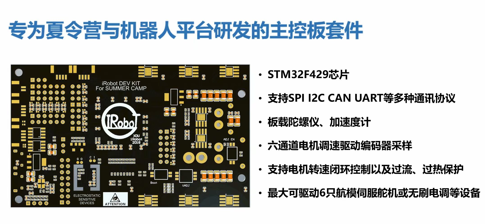
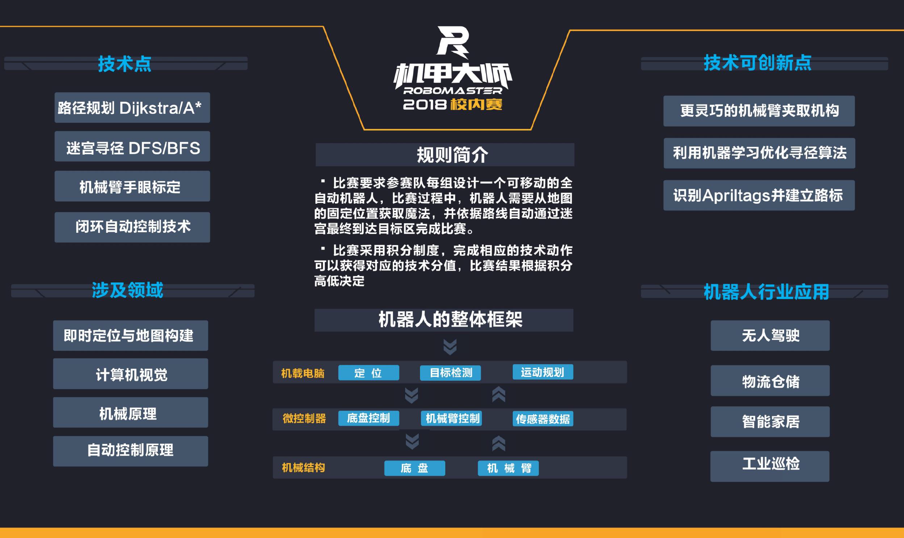
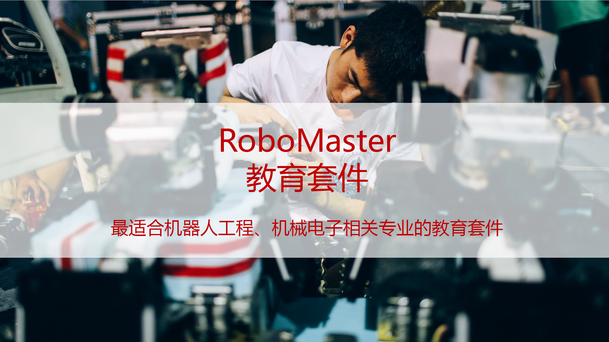

# 西电机器人暑假训练营
这是一个机器人比赛性质的夏令营，三周时间，打造机器人战车，在夏令营最后一天进行结营比赛。夏令营成员等于机器人队的实习队员，可以直接学习到制作Robomaster参赛机器人的相关技术。

在夏令营内部，我们对营员最大限度地开源往届参赛的技术，覆盖机械、硬件、电控、算法。在夏令营结束后，营员也需要把夏令营做过的东西全部开源，为之后的校内赛提供资料上的学习帮助，让技术得到积累，让更多热爱技术的人得到收获。

## Summer Camp 2018
60名成员按照技术方向，每10人随机分成一组，每组拥有1500元的备赛额度，可以自由购买物料（传感器、摄像头、工具等）。6个组共享机器人实验室的6台3D打印机和3台数控机床，具备基本的机械加工能力。

为了加速研发进度，每组在开营时领1个原型机器人，其中包括:
- 4个电机
- 4个麦克纳姆轮
- 带有4个独立悬挂的机器人底盘
- 1块最新款树莓派
- 1块stm32f4主控板

比赛场地是一个8mx5m的迷宫，由20cm高的木板作为围墙搭建。每个队伍要自主设计机器人，进入迷宫、抓取魔方、走出迷宫，根据用时长短排名。如果机器人没有成功抓取魔方，走出迷宫的用时会加5分钟；迷宫中一共有4个魔方，只有1个是复原的，如果抓取到复原魔方，总用时就会减去5分钟作为奖励，而抓取到普通的魔方，用时不增不减。

夏令营包含技术培训，包括Solidworks的使用、stm32的使用、linux操作系统的使用、git代码托管、以及一些机器人学。参加夏令营的成员需要预先掌握高数上下两册的全部内容、熟悉线性代数、C语言、以及计算机导论。

本次夏令营共有60名大一同学加入夏令营，他们的专业可以给以后希望加入的同学提供参考，而机器人技术是一项综合技术，无论来自什么专业都可以在团队中找到属于自己的位置：
- 管理科学与工程类
- 工业设计
- 电气工程及其自动化
- 电子封装技术
- 生物技术
- 通信工程专业
- 电子信息工程
- 微电子科学与工程
- 应用数学
- 探测制导与控制技术
- 软件工程
- 计算机科学与技术
- 遥感科学与技术
- 电磁场与无线技术
- 机械设计制造及自动化
- 测控技术与仪器
- 信息工程
- 集成电路设计与集成系统
- 智能科学与技术
- 信息对抗技术
- 电子科学与技术

同时，夏令营是校内赛主题的探索与尝试，本次夏令营的比赛内容沿用至西电RM2018校内赛，面向全校展开。

---
## Summer Camp 2019

根据夏令营与校内赛的实际情况反馈，我们发现了以下问题：

1. 全自动机器人主题对于入门选手门槛过高，技术侧重点容易跑偏。
2. 对于队员，这样的比赛参与度不足；对于观众，观赏性不足。
3. 考虑到个人能力，我们把10人分为一组，但是每组1台车没办法调动充足的人力，任务分配与调度容易卡死。
4. 平心而论，我们更希望招到优秀的机械、硬件队员，西电不缺会写代码的人。

同时，我们又对新一届夏令营抱有诸多期待：

1. 我们希望每组人数更多，这样更能体现在机器人备赛中的出现的各种团队管理问题，通过这种方式，历练夏令营成员的团队合作能力。
2. 虽然每组人多了，但是每车分配的人数需要变少，避免出现一个技术点卡住，所有人的进度都推不了的情况。
3. 技术主题更难，更上一层楼。

于是，西电机器人夏令营2019就此诞生。

---
Summer Camp 2019 依然招收60名营员，按照技术方向，每15人随机分成一组，每组拥有2000元的备赛额度，可以自由购买研发物资。

开营前三天是机器人技术培训，之后每组领取2个原型机器人底盘，营员需要在三周时间内将其改造为一台小型工程机器人和一台小型步兵机器人，最终以双车合作的形式完成比赛。

本次夏令营将使用RoboMaster教育套件，由[南京天之博特机器人科技有限公司](https://www.tianbot.com/)提供赞助。

### 夏令营比赛规则

本次夏令营要求每组设计2个可移动的遥控机器人，分为小型工程机器人和小型步兵机器人。

比赛开始，工程和步兵同时行动，工程负责获取小弹丸，给步兵补给子弹；步兵可携带一定量初始弹丸，先进行大门机关识别，再进行场地夺旗战。

比赛场地内共有9支旗帜，分为红蓝两面，步兵必须以射击的方式击倒旗帜，才算攻占；被占领的旗帜无法被另一方再次占领，最终占领旗帜多的一方获胜。

---
夏令营将于7月份进行，更多内容敬请期待！
